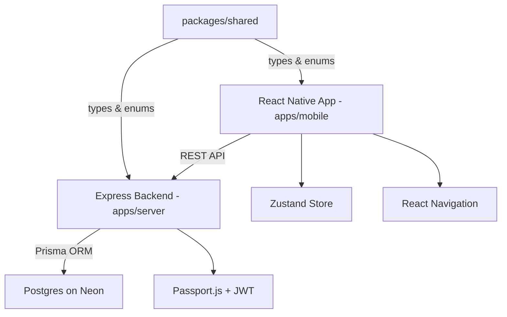

# Phase 1 Implementation Plan — Calorie Tracking CRUD App

## Problem Statement

Build a mobile calorie tracking app where users can sign up, log food entries with macro details, set daily goals, and view their daily and weekly intake summaries.

## Requirements

- Email/password authentication
- CRUD food entries (name, calories, protein, carbs, fat, serving size, meal type, timestamp)
- Meal types: breakfast, lunch, dinner, snack
- User-configurable daily calorie/macro goals
- Daily view: list of meals + totals vs goals
- Weekly view: daily totals overview
- Centralized theme/design system for easy color/style changes
- pnpm monorepo with shared types package

## Tech Stack

| Layer | Tech | Hosting | Cost |
|-------|------|---------|------|
| Monorepo | pnpm workspaces | — | Free |
| Frontend | React Native + Expo + TypeScript | — | Free |
| Navigation | React Navigation | — | Free |
| State Management | Zustand | — | Free |
| Backend | Node.js + Express + TypeScript | Render | Free |
| Auth | Passport.js + JWT | — | Free |
| Database | Postgres + Prisma ORM | Neon | Free |
| AI (Phase 2+) | Gemini API | — | Free tier |

## Proposed Solution

A pnpm monorepo with three packages: `apps/mobile` (React Native), `apps/server` (Express API), and `packages/shared` (shared TypeScript types/interfaces). The backend exposes REST endpoints for auth and food entry CRUD. The frontend consumes these endpoints, stores the auth token locally, and renders daily/weekly tracking views. A centralized theme config drives all styling.

### Monorepo Structure

```
snap-cals/
├── pnpm-workspace.yaml
├── package.json
├── apps/
│   ├── mobile/          # React Native + Expo
│   └── server/          # Express API
└── packages/
    └── shared/          # Shared types, enums, constants
```

### Architecture Diagram



## Task Breakdown

### Task 1: Monorepo scaffolding, theme system, and shared types ✅

- **Objective:** Set up the pnpm monorepo, all three packages, and establish the design system and shared types.
- **Guidance:**
  - Initialize pnpm workspace with `pnpm-workspace.yaml` pointing to `apps/*` and `packages/*`
  - Initialize `packages/shared` with TypeScript — define shared enums (`MealType`: breakfast, lunch, dinner, snack) and interfaces (`FoodEntry`, `Goal`, `User`, API request/response types)
  - Initialize Expo app in `apps/mobile` with TypeScript template
  - Initialize Express app in `apps/server` with TypeScript, `tsconfig`, `nodemon` for dev
  - Create `theme.ts` in `apps/mobile` with colors, spacing, font sizes
  - Set up folder structure: `apps/server` (routes, controllers, middleware, prisma), `apps/mobile` (screens, components, services, stores)
- **Test:** All three packages build. Shared types are importable from both apps. Both dev servers start without errors.
- **Demo:** Both dev servers running. A placeholder screen renders using theme colors. Shared types import works.

### Task 2: Database schema and Prisma setup ✅

- **Objective:** Define the Postgres schema and connect Prisma to Neon.
- **Guidance:**
  - Install Prisma in `apps/server`, initialize with `prisma init`
  - Define models: `User` (id, email, passwordHash, createdAt), `FoodEntry` (id, userId, name, calories, protein, carbs, fat, servingSize, mealType enum, date, createdAt, updatedAt), `Goal` (id, userId, dailyCalories, dailyProtein, dailyCarbs, dailyFat)
  - Ensure Prisma enums align with shared types in `packages/shared`
  - Run `prisma migrate dev` to create tables
  - Seed script with sample data
- **Test:** Migration runs successfully. Seed script populates data. Prisma Studio shows tables with data.
- **Demo:** Open Prisma Studio, show tables and seeded data.

### Task 3: Auth backend (signup + login) ✅

- **Objective:** Implement email/password signup and login endpoints with JWT.
- **Guidance:**
  - `POST /api/auth/signup` — hash password with bcrypt, create user, return JWT
  - `POST /api/auth/login` — verify credentials, return JWT
  - Passport.js JWT strategy for protecting routes
  - Auth middleware that extracts user from token
  - Input validation (valid email, password min length)
  - Error handling (duplicate email, wrong credentials)
  - Use shared types for request/response shapes
- **Test:** Signup creates user in DB. Login returns valid JWT. Invalid credentials return 401. Protected route rejects without token.
- **Demo:** Use Postman/curl to signup, login, and access a protected test endpoint.

### Task 4: Auth frontend (signup + login screens) ✅

- **Objective:** Build signup and login screens in the React Native app, store JWT, and handle auth flow.
- **Guidance:**
  - Create auth screens (Login, Signup) using theme system
  - API service layer to call backend auth endpoints, using shared types
  - Store JWT in `expo-secure-store`
  - Zustand auth store (token, user, isAuthenticated)
  - React Navigation auth flow: unauthenticated → Login/Signup stack, authenticated → main app stack
- **Test:** User can sign up, gets redirected to main app. User can log in. Token persists across app restarts. Invalid credentials show error.
- **Demo:** Full signup → login → main screen flow on device/simulator.

### Task 5: Food entry CRUD backend ✅

- **Objective:** Implement REST endpoints for food entry management.
- **Guidance:**
  - `POST /api/entries` — create food entry (all fields)
  - `GET /api/entries?date=YYYY-MM-DD` — get entries for a specific date
  - `GET /api/entries/week?startDate=YYYY-MM-DD` — get entries for a week
  - `PUT /api/entries/:id` — update entry
  - `DELETE /api/entries/:id` — delete entry
  - All routes protected, scoped to authenticated user
  - Input validation on all endpoints
  - Use shared types for request/response shapes
- **Test:** CRUD operations work via Postman. Users can only access their own entries. Invalid data returns validation errors.
- **Demo:** Full CRUD cycle via Postman — create, read, update, delete food entries.

### Task 6: Food entry form screen (Create + Edit) ✅

- **Objective:** Build the food entry form in the React Native app.
- **Guidance:**
  - Form with fields: food name, calories, protein, carbs, fat, serving size, meal type picker, date/time picker
  - Reusable form component for both create and edit modes
  - API service calls to backend using shared types
  - Input validation on the frontend
  - Success/error feedback
- **Test:** User can create a new entry. User can edit an existing entry. Validation prevents empty/invalid submissions.
- **Demo:** Create a food entry from the app, see it saved. Edit it, see changes reflected.

### Task 7: Daily view screen ✅

- **Objective:** Show all food entries for a selected day with totals and goal progress.
- **Guidance:**
  - List of food entries grouped by meal type (breakfast, lunch, dinner, snack)
  - Summary bar showing total calories/protein/carbs/fat vs daily goals
  - Date picker to navigate between days
  - Swipe or tap to edit/delete entries
  - FAB or button to add new entry
  - Pull to refresh
- **Test:** Entries display correctly for selected date. Totals calculate correctly. Navigating dates loads correct data. Delete removes entry from list.
- **Demo:** Show a full day of logged meals with totals and goal progress.

### Task 8: Goals setup screen

- **Objective:** Let users set and update their daily calorie/macro goals.
- **Guidance:**
  - `POST /api/goals` and `PUT /api/goals` backend endpoints
  - `GET /api/goals` to fetch current goals
  - Frontend screen with inputs for daily calories, protein, carbs, fat
  - Goals stored per user, reflected in daily view summary bar
  - Default goals if user hasn't set any (e.g., 2000 kcal)
  - Accessible from settings or profile area
- **Test:** User can set goals. Goals persist. Daily view reflects the correct goals. Updating goals updates the daily view.
- **Demo:** Set goals, navigate to daily view, see progress bars reflect the new targets.

### Task 9: Weekly view screen

- **Objective:** Show a weekly overview of daily calorie/macro totals.
- **Guidance:**
  - 7-day view showing each day's total calories and macros
  - Visual indicators (e.g., color coding) for days over/under goal
  - Tap a day to navigate to that day's daily view
  - Week navigation (previous/next week)
- **Test:** Weekly data aggregates correctly. Tapping a day navigates to daily view. Week navigation loads correct data.
- **Demo:** Show a week of tracked data with totals per day, navigate between weeks, tap into a specific day.

### Task 10: Wiring it all together + polish

- **Objective:** Connect all screens, add navigation tabs, error handling, and loading states.
- **Guidance:**
  - Bottom tab navigation: Daily View, Weekly View, Add Entry, Goals/Settings
  - Global error handling (network errors, expired tokens → redirect to login)
  - Loading spinners/skeletons while data fetches
  - Empty states (no entries for today, no goals set)
  - Logout functionality
- **Test:** Full user flow works end-to-end: signup → set goals → add entries → view daily → view weekly → edit → delete → logout → login.
- **Demo:** Complete walkthrough of the app from signup to a full day of tracking.

### Task 11: Unit and integration tests

- **Objective:** Add test coverage for backend API endpoints and frontend components.
- **Guidance:**
  - Backend: Jest + Supertest for API endpoint tests
    - Auth: signup (201, 409 duplicate, 400 validation), login (200, 401 bad credentials)
    - Entries: CRUD operations, authorization checks, date filtering
    - Goals: create/update, per-user scoping
  - Frontend: React Native Testing Library for component tests
    - Form validation behavior
    - Screen rendering with mock data
    - Navigation flows
- **Test:** All tests pass. Coverage report generated.
- **Demo:** Run `pnpm test` from root, show passing test suite.
