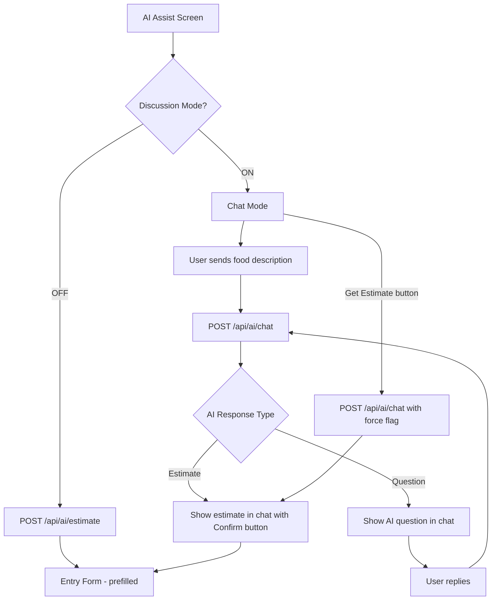

# Phase 3 Implementation Plan — AI Chat

## Problem Statement

Currently, the AI Assist flow is one-shot: user describes food → AI estimates macros → entry form. Users can't clarify ambiguities (portion size, brand, preparation method), so estimates may be less accurate. Phase 3 adds an optional conversational flow where the AI asks clarifying questions before producing its final estimate.

## Requirements

- The AI Assist screen keeps its current layout (text input + Estimate button)
- A "Discussion Mode" toggle appears below the input. When on, tapping Estimate starts a chat conversation instead of navigating to the entry form
- When off, behavior is identical to Phase 2 (one-shot estimate)
- In chat mode, the AI can ask clarifying questions to refine its estimate (capped at ~3 rounds)
- The AI proactively offers its final estimate when confident, but the user can also force an estimate at any time via a "Get Estimate" button
- When the estimate is ready, user confirms → navigates to entry form pre-filled
- User can go back from the entry form to continue the chat (history preserved in local state)
- A global default for Discussion Mode lives in Settings (persisted via SecureStore)
- Chat history is ephemeral — not saved to DB, only lives in screen state
- Conversation is client-managed — the mobile app sends full message history to the server each request, server is stateless

## Tech Additions

| Layer      | Tech                          | Notes                                              |
| ---------- | ----------------------------- | -------------------------------------------------- |
| Chat State | Zustand (settings store)      | Persisted discussion mode default via SecureStore   |
| AI Model   | `gemini-2.5-flash` (existing) | Multi-turn conversation via `contents` array        |

## Proposed Solution

The AI Assist screen gains two modes: the existing one-shot mode and a new chat mode controlled by the Discussion Mode toggle. In chat mode, the screen transforms into a message list with a text input at the bottom. The server gets a new `POST /api/ai/chat` endpoint that receives the full conversation history and returns the AI's next message (either a clarifying question or a final estimate). The Gemini system prompt instructs the AI to ask up to 3 clarifying questions before producing a structured nutrition estimate.

### Flow Diagram

```
AI Assist Screen (Discussion Mode OFF — unchanged):
  ├── Text input + "Estimate" button → POST /api/ai/estimate → Entry Form

AI Assist Screen (Discussion Mode ON):
  ├── Text input + "Estimate" button → starts chat
  ├── Chat message list (user + AI messages)
  ├── Text input at bottom for replies
  ├── "Get Estimate" button (force estimate at any time)
  └── AI sends final estimate → user confirms → Entry Form (navigate, not replace)
        └── User can go back → chat history still there
```

### Architecture Diagram



### Shared Types (additions to `packages/shared`)

```typescript
interface ChatMessage {
  role: "user" | "assistant";
  content: string;
}

interface AiChatRequest {
  messages: ChatMessage[];
  forceEstimate?: boolean;
}

interface AiChatResponse {
  message: string;
  estimate?: AiEstimateResponse;  // Present when AI provides final estimate
}
```

### New Files

```
apps/server/src/services/chat.service.ts       # Chat-specific Gemini logic (multi-turn)
apps/server/src/controllers/chat.controller.ts  # POST /api/ai/chat handler
apps/server/src/routes/chat.routes.ts           # /api/ai/chat route
apps/mobile/src/screens/ai-assist/chat-view.tsx # Chat message list component
apps/mobile/src/screens/ai-assist/use-chat.ts   # Chat state management hook
apps/mobile/src/stores/settings.store.ts        # Persisted settings (discussion mode default)
```

### Modified Files

```
packages/shared/src/index.ts                    # Add chat types
apps/server/src/routes/ai.routes.ts             # Mount chat route
apps/mobile/src/screens/ai-assist/index.tsx      # Add toggle + chat mode
apps/mobile/src/screens/ai-assist/use-ai-assist.ts  # Navigate instead of replace
apps/mobile/src/screens/settings/index.tsx       # Add Discussion Mode toggle
apps/mobile/src/services/api.ts                  # Add chat API method
```

## Task Breakdown

### Task 1: Shared types and settings store

- **Objective:** Add chat-related shared types and create a persisted settings store for the Discussion Mode default.
- **Guidance:**
  - Add `ChatMessage`, `AiChatRequest`, and `AiChatResponse` interfaces to `packages/shared/src/index.ts`
  - Create `apps/mobile/src/stores/settings.store.ts` — a Zustand store with `discussionMode: boolean`, `toggleDiscussionMode()`, and `restore()` that reads/writes to SecureStore (key: `discussion_mode_default`)
  - Default value: `false` (Discussion Mode off by default)
- **Test:** Shared types compile and are importable from both apps. Settings store persists and restores the toggle value.
- **Demo:** Import the new types in both apps — no errors. Toggle the setting in a quick test, restart, value persists.

### Task 2: Chat service on the server (multi-turn Gemini)

- **Objective:** Create a server-side chat service that accepts a conversation history and returns the AI's next response — either a clarifying question or a final nutrition estimate.
- **Guidance:**
  - Create `apps/server/src/services/chat.service.ts`
  - System prompt instructs Gemini: "You are a nutrition assistant. Ask up to 3 short clarifying questions to improve your estimate (portion size, brand, preparation). When you have enough info or the user wants an estimate now, respond with a JSON nutrition estimate. Always respond in JSON with `{ "type": "question", "content": "..." }` or `{ "type": "estimate", "content": "...", "estimate": { name, calories, protein, carbs, fat, servingSize } }`."
  - Use `responseMimeType: "application/json"` with a Zod schema for the response
  - Accept `messages: ChatMessage[]` and `forceEstimate: boolean` — when `forceEstimate` is true, append a system message telling the AI to produce its best estimate now
  - Map `ChatMessage[]` to Gemini's multi-turn `contents` format (array of `{ role, parts }`)
  - Validate and parse the response with Zod
- **Test:** Unit test with mocked Gemini client — verify it sends correct multi-turn format, handles question responses, handles estimate responses, and respects `forceEstimate`.
- **Demo:** Call the service directly with a sample conversation and see it return a question or estimate.

### Task 3: Chat API endpoint

- **Objective:** Expose `POST /api/ai/chat` that accepts a message history and returns the AI's next response.
- **Guidance:**
  - Create `apps/server/src/controllers/chat.controller.ts` — validate request body (messages array non-empty, each message has role + content), call chat service, return `AiChatResponse`
  - Register route in `apps/server/src/routes/ai.routes.ts` under `POST /chat`
  - Protected via JWT auth (same as `/estimate`)
  - Handle Gemini errors (rate limit → 429, other → 500)
- **Test:** Integration test with Supertest — 401 without token, 400 with empty messages, 200 with valid messages (mock chat service). Verify response shape matches `ApiResponse<AiChatResponse>`.
- **Demo:** Use curl to `POST /api/ai/chat` with a conversation and see the AI's response.

### Task 4: Discussion Mode toggle on AI Assist screen + Settings

- **Objective:** Add the Discussion Mode toggle to the AI Assist screen and a global default in Settings.
- **Guidance:**
  - Update `apps/mobile/src/screens/ai-assist/index.tsx` — add a toggle row below the text input labeled "Discussion Mode" with a `Switch` component. Initial value comes from the settings store.
  - Update `apps/mobile/src/screens/settings/index.tsx` — add an "AI" section with a "Discussion Mode" toggle that controls the global default via the settings store
  - Restore settings store on app startup (call `restore()` alongside auth restore)
  - When Discussion Mode is off, tapping Estimate behaves exactly as Phase 2
  - Add `chatNutrition` method to `apps/mobile/src/services/api.ts` — `POST /api/ai/chat`
- **Test:** Toggle renders and reflects settings store value. Toggling in Settings persists. AI Assist screen picks up the default. When off, Estimate still works as before.
- **Demo:** Toggle Discussion Mode in Settings → open AI Assist → see toggle reflects the default. Toggle it locally on the screen. One-shot mode still works when off.

### Task 5: Chat UI and conversation flow

- **Objective:** Build the chat message list and wire up the conversational flow when Discussion Mode is on.
- **Guidance:**
  - Create `apps/mobile/src/screens/ai-assist/chat-view.tsx` — a `FlatList` of chat bubbles (user messages right-aligned, AI messages left-aligned), using theme tokens
  - Create `apps/mobile/src/screens/ai-assist/use-chat.ts` — manages `messages: ChatMessage[]`, `loading`, `error`, `estimate` state. Exposes `sendMessage(text)` and `forceEstimate()`. Each call appends the user message, calls `api.chatNutrition(messages, forceEstimate)`, and appends the AI response.
  - Update `apps/mobile/src/screens/ai-assist/index.tsx`:
    - When Discussion Mode is on and user taps Estimate, switch to chat view: the food description becomes the first user message, send it to the chat endpoint
    - Show chat message list + text input at bottom for replies
    - Show a "Get Estimate" button (e.g., in the header or above the input) that calls `forceEstimate()`
    - When the AI returns an estimate, show it as a special message with a "Confirm" button
    - Tapping Confirm navigates to EntryForm with the estimate as `prefill`
  - Change `navigation.replace` to `navigation.navigate` in both chat and one-shot flows so the user can go back
- **Test:** Chat view renders messages correctly. Sending a message appends it and shows AI response. Force estimate triggers estimate. Confirm navigates to EntryForm. Going back preserves chat history.
- **Demo:** Full chat flow — type "big mac" → Estimate → AI asks "What size?" → user replies "large" → AI asks "Any modifications?" → user replies "no" → AI returns estimate → Confirm → Entry Form pre-filled. Go back → chat history still there.

### Task 6: Wiring, edge cases, and polish

- **Objective:** End-to-end integration, error handling, and documentation.
- **Guidance:**
  - Handle network errors in chat (show error message in chat, allow retry)
  - Handle Gemini rate limiting in chat ("AI is busy, try again in a moment")
  - Auto-scroll chat to bottom on new messages
  - Keyboard handling — input stays above keyboard in chat mode
  - Empty state: if AI returns an estimate on the very first response (no questions needed), go straight to confirm
  - Update `docs/phase-roadmap.md` to mark Phase 3 as completed
  - Update `docs/architecture.md` with chat service and `/api/ai/chat` endpoint
- **Test:** Full end-to-end flow works in both modes. Error states display correctly. Back navigation preserves chat. Settings persist.
- **Demo:** Complete walkthrough of both modes. Discussion Mode on: full chat → estimate → confirm → entry form → back → chat preserved. Discussion Mode off: one-shot estimate (unchanged). Error handling when API fails.

### Task 7: Comprehensive test coverage

- **Objective:** Add tests for all Phase 3 features (backend + frontend).
- **Guidance:**
  - Backend: Integration tests for `POST /api/ai/chat` (auth, validation, question response, estimate response, force estimate)
  - Backend: Unit tests for chat service (multi-turn format, force estimate flag, Zod validation)
  - Frontend:
    - Settings store (persist/restore discussion mode)
    - AI Assist screen (toggle renders, discussion mode on/off behavior)
    - Chat view (renders messages, user/AI bubble alignment)
    - Chat hook (send message, force estimate, navigate on confirm)
    - Settings screen (AI section with toggle)
  - Follow existing conventions in `.kiro/skills/mobile-testing-conventions.md`
- **Test:** All new tests pass. Existing tests unaffected. `pnpm test` runs full suite.
- **Demo:** Run `pnpm test` — all green, including new Phase 3 tests.
