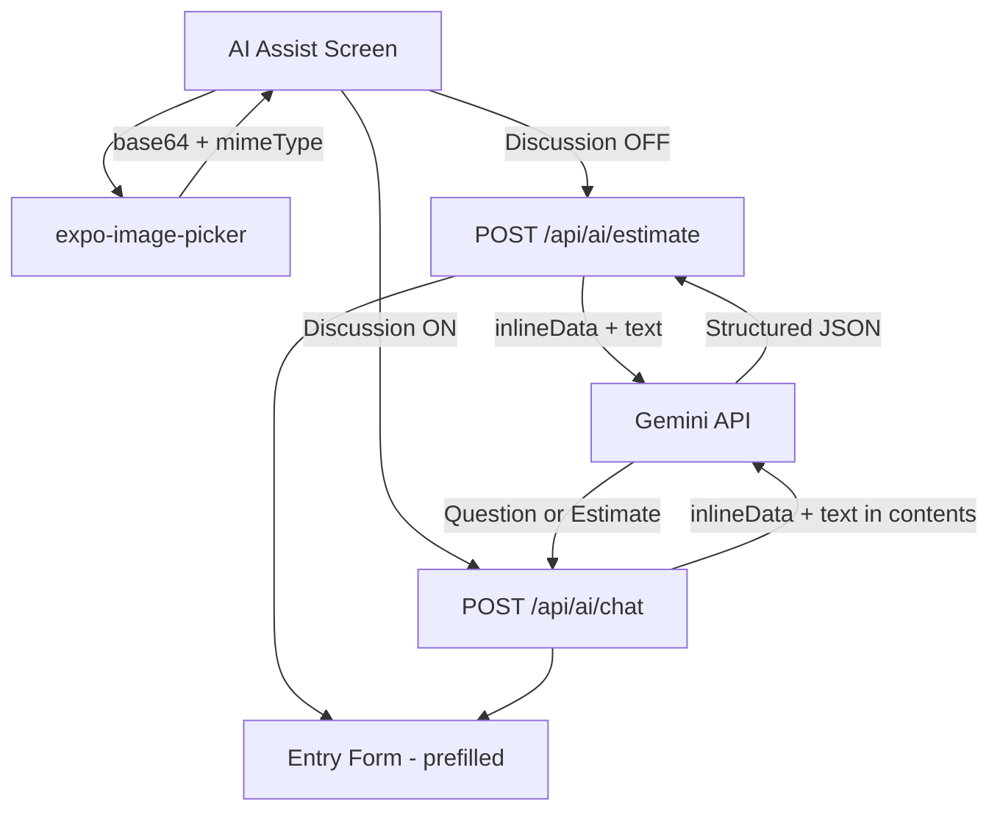

# Phase 4 Implementation Plan — Image Input

## Problem Statement

Users currently describe food via text (one-shot or chat). Phase 4 adds the ability to take a photo or pick one from the gallery, send it to Gemini for visual food recognition, and get nutrition estimates back — using the same confirmation and chat flows from Phases 2 and 3.

## Requirements

- User can take a photo (camera) or pick from gallery on the AI Assist screen
- Image is sent to the server, which forwards it to Gemini as inline base64 data alongside the nutrition estimation prompt
- Works in both one-shot mode (Discussion Mode off) and chat mode (Discussion Mode on)
- In one-shot mode: photo → estimate → entry form
- In chat mode: photo starts the conversation, AI can ask clarifying questions about the image
- A thumbnail preview of the selected image is shown on the AI Assist screen before sending
- User can still type text alongside the image (optional context like "I ate half of this")
- Existing text-only flows remain unchanged
- Image is not persisted to DB — ephemeral, same as chat history

## Tech Additions

| Layer        | Tech                          | Notes                                                    |
| ------------ | ----------------------------- | -------------------------------------------------------- |
| Image Picker | `expo-image-picker`           | Camera and gallery access, returns base64 + mimeType     |
| AI Model     | `gemini-2.5-flash` (existing) | Supports multimodal input (text + image) via inlineData  |

## Proposed Solution

Add a camera icon button on the AI Assist screen that opens an action sheet (Take Photo / Choose from Library). The selected image's base64 data and MIME type are sent to the server alongside the text description. The server's Gemini and chat services are updated to include the image as an `inlineData` part in the Gemini API call. The existing estimate and chat endpoints are extended to accept an optional `image` field.

### Flow Diagram

```
AI Assist Screen:
  ├── Text input + 📷 Camera button
  │     └── Action sheet: "Take Photo" / "Choose from Library"
  │           └── Image selected → thumbnail preview shown
  ├── Discussion Mode toggle
  │
  ├── Discussion OFF + text only   → POST /api/ai/estimate (existing)
  ├── Discussion OFF + image       → POST /api/ai/estimate (with image) → Entry Form
  ├── Discussion ON + text only    → POST /api/ai/chat (existing)
  └── Discussion ON + image        → POST /api/ai/chat (image in first message) → chat → Entry Form
```

### Architecture Diagram



### Shared Types (additions to `packages/shared`)

```typescript
interface ImageData {
  base64: string;
  mimeType: string;
}

// Updated existing interfaces
interface AiEstimateRequest {
  description: string;
  image?: ImageData;
}

interface AiChatRequest {
  messages: ChatMessage[];
  forceEstimate?: boolean;
  image?: ImageData;  // Only sent with the first message
}
```

### New Files

```
apps/mobile/src/screens/ai-assist/use-image-picker.ts  # Hook for camera/gallery with permissions
```

### Modified Files

```
packages/shared/src/index.ts                           # Add ImageData, update request types
apps/server/src/services/gemini.service.ts              # Accept optional image in estimateNutrition()
apps/server/src/services/chat.service.ts                # Accept optional image in chat()
apps/server/src/controllers/ai.controller.ts            # Validate + pass image to service
apps/server/src/controllers/chat.controller.ts          # Validate + pass image to service
apps/mobile/src/screens/ai-assist/index.tsx             # Camera button, image preview, pass image to hooks
apps/mobile/src/screens/ai-assist/use-ai-assist.ts      # Accept + send image with estimate
apps/mobile/src/screens/ai-assist/use-chat.ts           # Accept + send image with first message
apps/mobile/src/services/api.ts                         # Update estimate/chat methods for image
apps/mobile/app.json                                    # Add expo-image-picker plugin
```

## Task Breakdown

### Task 1: Shared types and server-side image support in Gemini services ✅

- **Objective:** Add `ImageData` type to shared package and update both Gemini services to accept an optional image alongside text.
- **Guidance:**
  - Add `ImageData` interface (`base64: string`, `mimeType: string`) to `packages/shared/src/index.ts`
  - Update `AiEstimateRequest` to include optional `image?: ImageData`
  - Update `AiChatRequest` to include optional `image?: ImageData`
  - Update `estimateNutrition()` in `gemini.service.ts` to accept an optional `ImageData` param. When present, build `contents` as an array with an `inlineData` part (`{ inlineData: { mimeType, data } }`) and a text part, instead of just a string.
  - Update `chat()` in `chat.service.ts` to accept an optional `ImageData` param. When present, prepend the image as an `inlineData` part in the first user message's `parts` array.
  - Add a `MAX_IMAGE_SIZE` constant to shared (e.g., `5 * 1024 * 1024` — 5MB base64 string length limit) for validation
- **Test:** Unit test both services with mocked Gemini client — verify the `contents` array includes `inlineData` when image is provided, and remains text-only when not.
- **Demo:** Call `estimateNutrition("chicken rice", { base64: "...", mimeType: "image/jpeg" })` directly and see structured JSON output.

### Task 2: Update API endpoints to accept image data ✅

- **Objective:** Update the estimate and chat controllers to validate and forward image data to the services.
- **Guidance:**
  - Update `ai.controller.ts`: extract `image` from request body, validate if present (must have `base64` and `mimeType` strings, `mimeType` must be one of `image/jpeg`, `image/png`, `image/webp`, `image/heic`, base64 length under `MAX_IMAGE_SIZE`). Allow request with image-only (no description text) — if image is provided, description can be empty (default to "Estimate the nutrition of this food").
  - Update `chat.controller.ts`: extract `image` from request body, same validation. Pass to chat service.
  - Increase Express body size limit for the AI routes to handle base64 payloads (e.g., `express.json({ limit: '10mb' })` on the AI router)
- **Test:** Integration tests — verify 400 with invalid mimeType, 400 with oversized image, 200 with valid image + description, 200 with image-only (no description). Existing text-only tests still pass.
- **Demo:** Use curl to `POST /api/ai/estimate` with a base64-encoded food photo and see nutrition estimates returned.

### Task 3: Install expo-image-picker and create image picker hook ✅

- **Objective:** Add `expo-image-picker` to the mobile app and create a reusable hook for camera/gallery image selection.
- **Guidance:**
  - Install `expo-image-picker` in `apps/mobile`
  - Add `expo-image-picker` to the `plugins` array in `app.json` with camera and photo library usage descriptions
  - Create `apps/mobile/src/screens/ai-assist/use-image-picker.ts` — exports `useImagePicker()` hook with:
    - `image` state: `{ uri: string; base64: string; mimeType: string } | null`
    - `pickFromCamera()`: requests camera permission, calls `launchCameraAsync({ base64: true, quality: 0.7, mediaTypes: ['images'] })`, sets image state
    - `pickFromGallery()`: calls `launchImageLibraryAsync({ base64: true, quality: 0.7, mediaTypes: ['images'] })`, sets image state
    - `clearImage()`: resets image state to null
    - Handle permission denied gracefully (alert user to enable in settings)
- **Test:** Verify hook returns correct state shape. Verify `clearImage` resets state.
- **Demo:** Call `pickFromCamera()` and `pickFromGallery()` from a test button — see image URI and base64 returned.

### Task 4: AI Assist screen — camera button, image preview, and wiring ✅

- **Objective:** Add the camera button to the AI Assist screen, show image preview, and wire image data through the estimate and chat flows.
- **Guidance:**
  - Add a camera icon button (Ionicons `camera-outline`) next to the text input on the AI Assist screen. Tapping it opens an action sheet with "Take Photo" and "Choose from Library" options (reuse the existing `ActionSheet` component).
  - When an image is selected, show a thumbnail preview (small `Image` component) with an "✕" button to remove it
  - Update `useAiAssist` hook: accept optional `ImageData`, pass it to `api.estimateNutrition()`. Allow estimate with image-only (no text required when image is present).
  - Update `useChat` hook: accept optional `ImageData`, send it with the first `api.chatNutrition()` call only (not on subsequent messages — the AI already has the image context from the first turn)
  - Update `api.ts`: update `estimateNutrition` to accept optional `ImageData` and include it in the request body. Update `chatNutrition` to accept optional `ImageData`.
  - Update the Estimate button's disabled state: enabled when text OR image is present (not just text)
- **Test:** Verify camera button renders. Verify image preview shows after selection. Verify remove button clears image. Verify Estimate button enabled with image-only. Verify image data flows through to API calls.
- **Demo:** Full flow — tap camera → take photo → see preview → tap Estimate → loading → Entry Form pre-filled with nutrition data from the photo. Also: image + Discussion Mode on → chat flow with image context.

### Task 5: Edge cases, polish, and documentation ✅

- **Objective:** Handle error cases, polish the UX, and update documentation.
- **Guidance:**
  - Handle large images: if base64 exceeds `MAX_IMAGE_SIZE`, show an error ("Image is too large, try a smaller photo")
  - Handle permission denied: show alert with "Open Settings" option
  - Handle Gemini errors specific to image input (e.g., image not recognized as food — the AI should still return its best guess, but handle cases where it can't)
  - Image preview should be small and not dominate the screen (e.g., 80x80 rounded thumbnail)
  - Clear image state when navigating away from AI Assist screen and coming back
  - Update `docs/architecture.md` with image input flow and `expo-image-picker` addition
- **Test:** Full end-to-end flow works for all four combinations (text-only one-shot, text-only chat, image one-shot, image chat). Error states display correctly. Existing flows unaffected.
- **Demo:** Complete walkthrough of all input modes. Image one-shot: photo → estimate → entry form. Image chat: photo → AI asks "How much did you eat?" → reply → estimate → confirm. Error: oversized image shows error. Permission denied shows alert.

### Task 6: Comprehensive test coverage

- **Objective:** Add tests for all Phase 4 features (backend + frontend).
- **Guidance:**
  - Update `docs/phase-roadmap.md` to mark Phase 4 as completed
  - Backend: Integration tests for estimate endpoint with image (valid image, invalid mimeType, oversized, image-only no description)
  - Backend: Integration tests for chat endpoint with image
  - Backend: Unit tests for gemini.service with image (verify inlineData in contents)
  - Backend: Unit tests for chat.service with image (verify image in first message parts)
  - Frontend:
    - `useImagePicker` hook (pick from camera, pick from gallery, clear image, permission handling)
    - AI Assist screen (camera button renders, action sheet opens, image preview shows, remove button works)
    - `useAiAssist` with image (sends image data, works without text)
    - `useChat` with image (sends image on first message only)
  - Follow existing conventions in `.kiro/skills/mobile-testing-conventions.md`
- **Test:** All new tests pass. Existing tests unaffected. `pnpm test` runs full suite.
- **Demo:** Run `pnpm test` — all green, including new Phase 4 tests. Mark Phase 4 as completed in `docs/phase-roadmap.md`.
