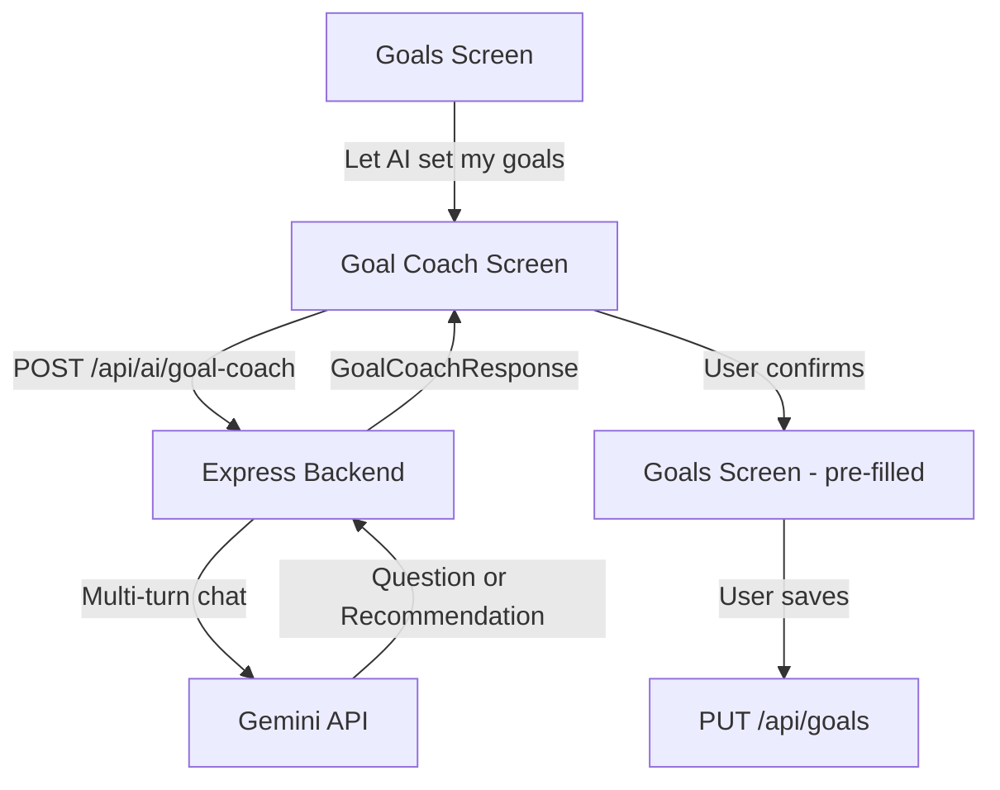

# Phase 6 Implementation Plan — AI Goal Coach

## Problem Statement

Users currently set their daily calorie/macro goals manually by typing numbers into the Goals screen. Phase 6 adds a conversational AI coach that asks about the user's objectives, body stats, and activity level, then recommends personalized daily calorie and macro targets using established nutrition science (Mifflin-St Jeor TDEE + evidence-based macro splits). The recommended goals pre-fill the Goals screen for review before saving.

## Requirements

- Accessible via a "Let AI set my goals" button on the Goals screen
- Always conversational — the AI gathers context through a multi-turn chat
- AI asks about: goal type, sex, age, weight, height, activity level, rate preference
- AI is smart about batched info — if the user provides multiple details in one message, it acknowledges them and only asks for what's missing
- Uses Mifflin-St Jeor equation for BMR, activity multipliers for TDEE, and evidence-based macro splits per goal type
- Safety guardrails: minimum calorie floors, no extreme deficits, no very low-calorie diet recommendations
- Final recommendation includes daily calories, protein, carbs, fat, and a brief explanation of the reasoning
- User confirms → navigates to Goals screen pre-filled with the AI's recommendation for review/editing before saving
- Chat history is ephemeral (screen state only, not persisted to DB)
- Same stateless multi-turn pattern as the food chat (client sends full message history each request, server is stateless)

## Background — Nutrition Science

The AI's system prompt encodes the following nutrition science so it can compute and explain its recommendations.

### BMR — Mifflin-St Jeor Equation

- Men: `BMR = (10 × weight_kg) + (6.25 × height_cm) - (5 × age) + 5`
- Women: `BMR = (10 × weight_kg) + (6.25 × height_cm) - (5 × age) - 161`

### TDEE — Activity Multipliers

| Level             | Multiplier | Description                       |
| ----------------- | ---------- | --------------------------------- |
| Sedentary         | 1.2        | Little or no exercise, desk job   |
| Lightly active    | 1.375      | Light exercise 1–3 days/week      |
| Moderately active | 1.55       | Moderate exercise 3–5 days/week   |
| Very active       | 1.725      | Hard exercise 6–7 days/week       |
| Extremely active  | 1.9        | Very hard exercise + physical job |

TDEE = BMR × activity multiplier

### Calorie Adjustments by Goal

| Goal               | Adjustment                                        | Expected Rate            |
| ------------------ | ------------------------------------------------- | ------------------------ |
| Lose weight        | −300 to −600 kcal/day from TDEE                   | ~0.5–1 kg/week           |
| Maintain           | Eat at TDEE                                       | —                        |
| Body recomposition | Maintenance or slight deficit (−100 to −200 kcal) | Slow, scale may not move |
| Lean bulk          | +200 to +300 kcal above TDEE                      | ~0.25–0.5 kg/month       |
| Muscle gain        | +200 to +500 kcal above TDEE                      | Varies                   |

### Macro Targets by Goal (per kg bodyweight)

| Goal               | Protein      | Fat                | Carbs                              |
| ------------------ | ------------ | ------------------ | ---------------------------------- |
| Weight loss        | 1.6–2.2 g/kg | 0.7–1.0 g/kg       | Fill remaining calories            |
| Maintenance        | 1.4–2.0 g/kg | 20–30% of calories | 45–55% of calories                 |
| Body recomposition | 1.6–2.2 g/kg | 0.7–1.0 g/kg       | Fill remaining calories            |
| Muscle gain        | 1.6–2.2 g/kg | 0.7–1.0 g/kg       | Fill remaining calories (4–5 g/kg) |

### Safety Guardrails

- Minimum daily intake: ~1200 kcal (women), ~1500 kcal (men)
- Never recommend very low-calorie diets (<800 kcal) — those require medical supervision
- Maximum recommended weight loss rate: ~1 kg/week
- Always include a disclaimer that these are estimates and users should consult a healthcare professional for medical advice

### Key Information the AI Should Gather

1. **Goal type** — lose weight, gain muscle, maintain, body recomposition
2. **Sex** — needed for BMR formula
3. **Age** — needed for BMR formula
4. **Current weight (kg)** — needed for BMR + protein calculation
5. **Height (cm)** — needed for BMR formula
6. **Activity level** — needed for TDEE multiplier
7. **Rate preference** (for weight loss/gain) — moderate vs aggressive
8. **Dietary preferences/restrictions** (optional) — useful context for the AI's explanation

## Proposed Solution

A new "Goal Coach" screen accessible from the Goals screen via a "Let AI set my goals" button. The screen uses the same chat bubble UI pattern as the AI Assist food chat. A new `POST /api/ai/goal-coach` endpoint handles the multi-turn conversation with a goal-coaching system prompt. When the AI produces its final recommendation, it appears as a special message with the macro breakdown and a "Set as my goals" button. Tapping it navigates back to the Goals screen with the values pre-filled.

### Flow Diagram

```
Goals Screen → "Let AI set my goals" button → Goal Coach Screen
  ├── AI greets user, asks about their goal
  ├── Multi-turn chat (AI gathers: goal type, sex, age, weight, height, activity level, rate)
  ├── AI computes TDEE + macros, presents recommendation with explanation
  ├── User taps "Set as my goals"
  └── Navigate to Goals Screen (pre-filled with AI recommendation)
        └── User reviews/edits → saves normally
```

### Architecture Diagram



### Shared Types (additions to `packages/shared`)

```typescript
interface GoalCoachRequest {
  messages: ChatMessage[]; // Reuse existing ChatMessage type
}

interface GoalRecommendation {
  dailyCalories: number;
  dailyProtein: number;
  dailyCarbs: number;
  dailyFat: number;
  explanation: string;
}

interface GoalCoachResponse {
  message: string;
  recommendation?: GoalRecommendation; // Present when AI provides final recommendation
}
```

### New Files

```
apps/server/src/services/goal-coach.service.ts        # Goal coach Gemini logic (multi-turn)
apps/server/src/controllers/goal-coach.controller.ts   # POST /api/ai/goal-coach handler
apps/mobile/src/screens/goal-coach/index.tsx           # Goal Coach chat screen
apps/mobile/src/screens/goal-coach/use-goal-coach.ts   # Chat state management hook
```

### Modified Files

```
packages/shared/src/index.ts                    # Add GoalCoachRequest, GoalRecommendation, GoalCoachResponse
apps/server/src/routes/ai.routes.ts             # Mount goal-coach route
apps/mobile/src/screens/goals/index.tsx          # Add "Let AI set my goals" button, accept prefill param
apps/mobile/src/screens/goals/use-goals.ts       # Accept prefill values to initialize form state
apps/mobile/src/services/api.ts                  # Add goalCoach API method
apps/mobile/src/navigation.tsx                   # Add GoalCoach route to MainStackParamList
```

## Task Breakdown

### Task 1: Shared types and goal coach Gemini service

- **Objective:** Add goal-coach shared types and create the server-side service that manages the multi-turn goal-coaching conversation with Gemini.
- **Guidance:**
  - Add `GoalCoachRequest`, `GoalRecommendation`, and `GoalCoachResponse` interfaces to `packages/shared/src/index.ts`
  - Create `apps/server/src/services/goal-coach.service.ts`
  - System prompt encodes the nutrition science from the Background section: Mifflin-St Jeor formula, activity multipliers (1.2–1.9), calorie adjustments per goal type, protein targets (1.6–2.2 g/kg), fat floor (0.7–1.0 g/kg), remaining calories from carbs, safety minimums (1200/1500 kcal)
  - Prompt instructs the AI to: greet the user and ask about their goal, gather info conversationally (goal type, sex, age, weight, height, activity level), be smart about batched info (acknowledge multiple details, only ask for what's missing), ask up to ~5 rounds of questions, then produce a recommendation with a brief explanation
  - Response schema uses Zod discriminated union: `{ type: "question", content: string }` or `{ type: "recommendation", content: string, recommendation: { dailyCalories, dailyProtein, dailyCarbs, dailyFat, explanation } }`
  - Same pattern as `chat.service.ts` — maps `ChatMessage[]` to Gemini `contents` format, uses `responseMimeType: "application/json"` with `responseJsonSchema` from the Zod schema
  - Reuse `createGeminiClient()` from `gemini.service.ts`
- **Test:** Unit test with mocked Gemini client — verify it sends correct multi-turn format, handles question responses, handles recommendation responses, and validates with Zod.
- **Demo:** Call the service directly with a sample conversation and see it return a question or recommendation.

### Task 2: Goal coach API endpoint

- **Objective:** Expose `POST /api/ai/goal-coach` that accepts a message history and returns the AI's next response.
- **Guidance:**
  - Create `apps/server/src/controllers/goal-coach.controller.ts` — validate request body (messages array non-empty, each message has role + content), call goal coach service, return `GoalCoachResponse` wrapped in `ApiResponse`
  - Register route in `apps/server/src/routes/ai.routes.ts` under `POST /goal-coach`
  - Protected via JWT auth (same middleware as other AI endpoints)
  - Handle Gemini errors gracefully (rate limit → 429, other → 500)
- **Test:** Integration test with Supertest — verify 401 without token, 400 with empty messages, 200 with valid messages (mock goal coach service to avoid real API calls). Verify response shape matches `ApiResponse<GoalCoachResponse>`.
- **Demo:** Use curl to `POST /api/ai/goal-coach` with `{ "messages": [{ "role": "user", "content": "I want to lose weight" }] }` and see the AI's response.

### Task 3: Goal Coach screen with chat UI

- **Objective:** Build the Goal Coach screen with the chat bubble UI and wire up the multi-turn conversation flow.
- **Guidance:**
  - Create `apps/mobile/src/screens/goal-coach/index.tsx` and `use-goal-coach.ts`
  - Reuse the `chat-view.tsx` bubble component from AI Assist for rendering messages
  - `use-goal-coach.ts` manages `messages: ChatMessage[]`, `loading`, `error`, `recommendation` state. Exposes `sendMessage(text)`. Each call appends the user message, calls `api.goalCoach(messages)`, and appends the AI response.
  - On mount, auto-send an initial message to get the AI's greeting (e.g., send a system-triggered first message like "I'd like help setting my nutrition goals")
  - When the AI returns a recommendation, show it as a special styled message with the macro breakdown (calories, protein, carbs, fat) and a "Set as my goals" button
  - Tapping "Set as my goals" navigates to the Goals screen with the recommendation as a `prefill` route param
  - Add `goalCoach` method to `apps/mobile/src/services/api.ts` — `POST /api/ai/goal-coach`
  - Add `GoalCoach` to `MainStackParamList` in `navigation.tsx` and register the screen
- **Test:** Verify screen renders chat UI. Verify sending a message appends it and shows AI response. Verify recommendation displays with confirm button. Verify confirm navigates to Goals screen with prefill.
- **Demo:** Full chat flow — open Goal Coach → AI greets → user says "I want to lose weight, I'm a 28yo male, 80kg, 178cm" → AI asks about activity level → user replies → AI recommends goals → tap "Set as my goals" → Goals screen pre-filled.

### Task 4: Goals screen pre-fill support and Goal Coach entry point

- **Objective:** Add the "Let AI set my goals" button to the Goals screen and support pre-filling from the Goal Coach.
- **Guidance:**
  - Update `MainStackParamList` to add optional `prefill` param to the Goals route (type: `GoalRecommendation`)
  - Update `use-goals.ts` to accept `prefill` — when present, initialize form fields from prefill data instead of fetching from API
  - Add a button on the Goals screen (below the save button or as a secondary action) — "Let AI set my goals" with a sparkle icon (`sparkles-outline`), navigates to `GoalCoach` screen
  - When returning from Goal Coach with prefill, show a snackbar: "AI recommendation applied — review and save"
- **Test:** Verify "Let AI set my goals" button renders and navigates to Goal Coach. Verify Goals screen fields populated from prefill. Verify user can edit pre-filled fields. Verify save works with pre-filled data. Verify normal flow (no prefill) still works.
- **Demo:** Goals screen → tap "Let AI set my goals" → Goal Coach → conversation → recommendation → "Set as my goals" → Goals screen pre-filled with AI values → edit one number → save.

### Task 5: Edge cases, polish, and documentation

- **Objective:** Handle error cases, polish UX, and update documentation.
- **Guidance:**
  - Handle network errors in chat (show error message in chat, allow retry)
  - Handle Gemini rate limiting ("AI is busy, try again in a moment")
  - Auto-scroll chat to bottom on new messages
  - Keyboard handling — input stays above keyboard in chat mode
  - Back navigation: Goal Coach → back → Goals screen (no prefill applied)
  - If user provides nonsensical data (e.g., weight of 5kg), the AI should handle it gracefully via its prompt (ask for clarification)
  - Update `docs/architecture.md` with goal coach service and `/api/ai/goal-coach` endpoint
- **Test:** Full end-to-end flow works. Error states display correctly. Back navigation correct. Manual goal entry unaffected.
- **Demo:** Complete walkthrough: Goals → Goal Coach → full conversation → recommendation → pre-fill → save. Also: error handling when API fails, back navigation without saving.

### Task 6: Comprehensive test coverage

- **Objective:** Add tests for all Phase 6 features (backend + frontend).
- **Guidance:**
  - Backend: Unit tests for goal coach service (multi-turn format, question response, recommendation response, Zod validation)
  - Backend: Integration tests for `POST /api/ai/goal-coach` (auth, validation, question response, recommendation response)
  - Frontend:
    - Goal Coach screen (renders chat, sends messages, shows recommendation with confirm button)
    - `use-goal-coach` hook (send message, recommendation state, navigate on confirm)
    - Goals screen ("Let AI set my goals" button renders, navigates to Goal Coach, pre-fill from route params, save with pre-filled data)
  - Follow existing conventions in `.kiro/skills/mobile-testing-conventions.md`
  - Update `docs/phase-roadmap.md` to mark Phase 6 status
- **Test:** All new tests pass. Existing tests unaffected. `pnpm test` runs full suite.
- **Demo:** Run `pnpm test` — all green, including new Phase 6 tests.
