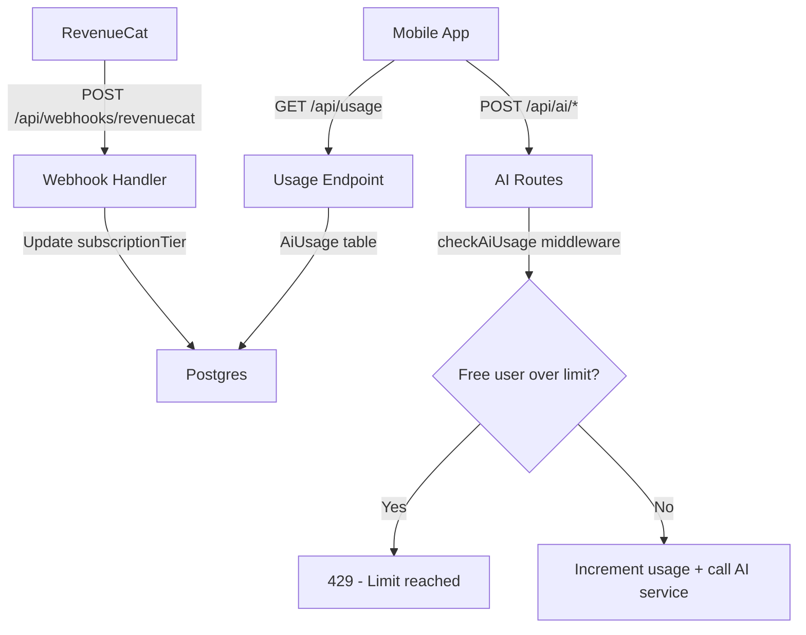

# Phase 8: Subscription & Usage Limits — Implementation Plan

## Problem Statement

The app currently gives all users unlimited access to AI features (estimate, chat, goal coach). Phase 8 introduces a freemium model with daily AI usage limits. Free users get a configurable number of AI lookups per day (resetting at UTC 00:00); Pro subscribers get unlimited access. Includes server-side usage tracking, limit enforcement middleware, frontend blocking UX, a webhook endpoint ready for RevenueCat, and a subscription tier on the User model (manually updatable for now, with RevenueCat SDK integration deferred to Phase 9).

## Requirements

- `SubscriptionTier` enum (`FREE` / `PRO`) on User model, defaulting to `FREE`
- `AiUsage` table tracking per-user per-day usage counts (period = UTC date string)
- Configurable daily limit constant (`FREE_DAILY_AI_LIMIT = 3`) in shared package — single source of truth
- Every call to `/ai/estimate`, `/ai/chat`, `/ai/goal-coach` counts as 1 usage
- Pro users bypass limits entirely
- Usage display in Settings: "AI Lookups Today: 2 / 3" (hidden for Pro)
- When a free user hits the limit and taps AI Assist or AI Goal Coach, intercept with a modal before navigation showing limit reached + reset time + "Upgrade to Pro" button
- "Upgrade to Pro" button shows "Coming soon" alert for now (RevenueCat SDK deferred to Phase 9)
- Webhook endpoint `POST /api/webhooks/revenuecat` ready to receive RevenueCat events and update subscription tier
- Manually updatable via Prisma Studio for testing
- Daily reset at UTC 00:00 (server computes today as `new Date().toISOString().slice(0, 10)`)

## Background

Current AI state:
- Three AI endpoints: `POST /ai/estimate`, `POST /ai/chat`, `POST /ai/goal-coach` — all behind `authenticate` middleware in `ai.routes.ts`
- No usage tracking or rate limiting exists
- `User` model has no subscription/tier concept

RevenueCat webhook format:
- POST body: `{ api_version: "1.0", event: { type, app_user_id, ... } }`
- Key events for subscription lifecycle: `INITIAL_PURCHASE` and `RENEWAL` → activate Pro, `EXPIRATION` and `CANCELLATION` → revert to Free
- `app_user_id` maps to our User ID (configured when setting up RevenueCat SDK in Phase 9)
- Authorization header for webhook authentication (configured in RevenueCat dashboard)
- RevenueCat retries up to 5 times on non-200 responses, so the handler must always return 200 for known events
- Idempotent handling recommended — same event may arrive more than once

Mobile navigation context:
- FAB action sheet on Daily View has "AI Assist" option → navigates to `AiAssist` screen
- Goals screen has "Let AI set my goals" button → navigates to `GoalCoach` screen
- Settings screen has Appearance, AI, and Account sections — usage row fits in a new "Subscription" section

## Proposed Solution

Add a `SubscriptionTier` enum and `subscriptionTier` field to User. Add an `AiUsage` model for daily tracking. Create middleware that runs before all AI routes: checks tier, checks/increments daily usage, returns 429 if over limit. Add a `GET /api/usage` endpoint so the mobile app can fetch current usage. Add a RevenueCat webhook endpoint. On mobile, add a usage row in Settings, and intercept AI navigation with a limit-reached modal.

### Flow Diagram

```
User taps "AI Assist" or "AI Goal Coach"
  ├── App checks local usage state (fetched from GET /api/usage)
  ├── If PRO or under limit → navigate normally
  └── If FREE and at limit → show modal:
        "You've used all 3 AI lookups today"
        "Resets at midnight UTC"
        [Upgrade to Pro] → "Coming soon" alert
        [Close]
```

### Architecture Diagram



### Data Model Changes

```
enum SubscriptionTier {
  FREE
  PRO
}

// Add to User model:
subscriptionTier SubscriptionTier @default(FREE)

model AiUsage {
  id        String   @id @default(cuid())
  userId    String
  period    String   // UTC date string: "2026-03-22"
  count     Int      @default(0)
  createdAt DateTime @default(now())
  updatedAt DateTime @updatedAt
  user      User     @relation(fields: [userId], references: [id])

  @@unique([userId, period])
}
```

### Shared Types (additions to `packages/shared`)

```typescript
export enum SubscriptionTier {
  FREE = "FREE",
  PRO = "PRO",
}

export const FREE_DAILY_AI_LIMIT = 3;

export interface AiUsageResponse {
  used: number;
  limit: number;
  resetsAt: string; // ISO timestamp of next UTC midnight
  tier: SubscriptionTier;
}
```

### New Files

```
apps/server/src/middleware/ai-usage.ts                # Usage check + increment middleware
apps/server/src/controllers/usage.controller.ts       # GET /api/usage handler
apps/server/src/routes/usage.routes.ts                # /api/usage route
apps/server/src/controllers/webhook.controller.ts     # POST /api/webhooks/revenuecat handler
apps/server/src/routes/webhook.routes.ts              # /api/webhooks route
apps/mobile/src/stores/usage.store.ts                 # Zustand store for usage state
apps/mobile/src/components/usage-limit-modal.tsx      # Limit reached modal component
```

### Modified Files

```
apps/server/prisma/schema.prisma                      # SubscriptionTier enum, AiUsage model, User field
packages/shared/src/index.ts                          # SubscriptionTier enum, FREE_DAILY_AI_LIMIT, AiUsageResponse, User interface
apps/server/src/routes/ai.routes.ts                   # Add checkAiUsage middleware
apps/server/src/app.ts                                # Mount /api/usage and /api/webhooks routes
apps/mobile/src/services/api.ts                       # Add getUsage method
apps/mobile/src/screens/settings/index.tsx            # Add Subscription section with usage display
apps/mobile/src/screens/daily-view/index.tsx          # Intercept AI Assist navigation at limit
apps/mobile/src/screens/goals/index.tsx               # Intercept Goal Coach navigation at limit
apps/mobile/src/navigation.tsx                        # Fetch usage on app startup
```

## Task Breakdown

### Task 1: DB schema migration + shared types + constants

- [ ] **Objective:** Add `SubscriptionTier` enum, `subscriptionTier` field on User, `AiUsage` model, and shared types/constants.
- **Guidance:**
  - Add `SubscriptionTier` enum (`FREE`, `PRO`) to Prisma schema
  - Add `subscriptionTier SubscriptionTier @default(FREE)` to User model
  - Add `AiUsage` model with `id`, `userId`, `period` (String), `count` (Int, default 0), `createdAt`, `updatedAt`, `@@unique([userId, period])`, relation to User
  - Add `aiUsage AiUsage[]` relation to User model
  - Generate migration with `prisma migrate dev --create-only`
  - Update seed script: seeded test user stays `FREE` (default)
  - Update test helper `cleanDb`: delete from `AiUsage` before `User`
  - Add to `packages/shared/src/index.ts`: `SubscriptionTier` enum, `FREE_DAILY_AI_LIMIT = 3` constant, `AiUsageResponse` interface
  - Add `subscriptionTier` to the shared `User` interface
  - Run migration on test DB (`pnpm migrate:test`)
  - Verify all existing tests pass
- **Test:** Migration applies cleanly. Shared types compile. Existing tests pass.
- **Demo:** Open Prisma Studio → see `subscriptionTier` on User (defaulting to FREE) and empty `AiUsage` table.

### Task 2: Usage tracking middleware + usage endpoint (backend)

- [ ] **Objective:** Create middleware that checks and increments AI usage for free users, and a `GET /api/usage` endpoint for the mobile app.
- **Guidance:**
  - Create `src/middleware/ai-usage.ts` — `checkAiUsage` middleware:
    - Get user from `req.user`, compute today as `new Date().toISOString().slice(0, 10)`
    - If `user.subscriptionTier === "PRO"`, call `next()` (skip limits)
    - Otherwise, upsert `AiUsage` for `[userId, period]`, check if `count >= FREE_DAILY_AI_LIMIT`
    - If over limit, return 429 with `{ message: "Daily AI limit reached", used, limit, resetsAt }`
    - If under limit, increment count and call `next()`
    - Use Prisma's `upsert` with atomic `increment` to avoid race conditions
  - Create `src/controllers/usage.controller.ts` — `getUsage` handler:
    - Query `AiUsage` for today's period, return `AiUsageResponse` with `used`, `limit`, `resetsAt` (next UTC midnight as ISO string), `tier`
    - If no row exists for today, return `used: 0`
  - Create `src/routes/usage.routes.ts` — `GET /` behind `authenticate`
  - Register in `app.ts` at `/api/usage`
  - Add `checkAiUsage` middleware to `ai.routes.ts` (after `authenticate`, before route handlers)
- **Test:** Integration tests: free user gets 429 after 3 AI calls in a day. Pro user never gets 429. `GET /api/usage` returns correct counts. Usage resets with a new date period. 429 response includes `used`, `limit`, `resetsAt`.
- **Demo:** curl 3 estimate requests as a free user → 4th returns 429. Manually set user to PRO in Prisma Studio → unlimited. `GET /api/usage` shows correct count.

### Task 3: RevenueCat webhook endpoint (backend)

- [ ] **Objective:** Create a webhook endpoint that receives RevenueCat events and updates the user's subscription tier.
- **Guidance:**
  - Add `REVENUECAT_WEBHOOK_SECRET` to `.env.example`
  - Create `src/controllers/webhook.controller.ts` — `handleRevenueCat` handler:
    - Verify authorization header matches `REVENUECAT_WEBHOOK_SECRET`
    - Parse `event.type` and `event.app_user_id` from the request body
    - For `INITIAL_PURCHASE`, `RENEWAL`, `UNCANCELLATION` → set `subscriptionTier: PRO`
    - For `EXPIRATION`, `CANCELLATION` → set `subscriptionTier: FREE`
    - For other event types → log and return 200 (ignore gracefully)
    - Look up user by `app_user_id` (which will be our User ID). If not found, log warning and return 200
    - Always return 200 (RevenueCat retries on non-200)
    - Idempotent — safe to receive duplicate events
  - Create `src/routes/webhook.routes.ts` — `POST /revenuecat` (no auth middleware — uses webhook secret header instead)
  - Register in `app.ts` at `/api/webhooks`
- **Test:** Integration tests: valid INITIAL_PURCHASE → user becomes PRO. Valid EXPIRATION → user becomes FREE. Invalid auth header → 401. Unknown user → 200 (no crash). Unknown event type → 200.
- **Demo:** curl a mock RevenueCat webhook → user tier updates in DB.

### Task 4: Mobile — usage store, API method, and Settings UI

- [ ] **Objective:** Add a usage store, fetch usage from the server, and display it in Settings.
- **Guidance:**
  - Add `getUsage` method to `api.ts` — `GET /api/usage`
  - Create `src/stores/usage.store.ts` — Zustand store with `used`, `limit`, `resetsAt`, `tier`, `isLoading`, `fetch()` action that calls `api.getUsage()` and updates state
  - Call `usageStore.fetch()` on app startup (alongside auth restore) and after any AI call completes
  - Update Settings screen: add a "Subscription" section between "AI" and "Account" with:
    - Row showing tier: "Plan: Free" or "Plan: Pro" with a crown icon for Pro
    - Row showing usage: "AI Lookups Today: 2 / 3" (hidden for Pro users)
    - "Upgrade to Pro" row (only for Free users) → shows "Coming soon" alert
- **Test:** Settings screen renders usage info. Usage store fetches and updates correctly. Pro users don't see usage count.
- **Demo:** Open Settings → see "Plan: Free", "AI Lookups Today: 0 / 3", "Upgrade to Pro". Use an AI feature → count updates.

### Task 5: Mobile — AI navigation interception with limit modal

- [ ] **Objective:** Intercept navigation to AI Assist and Goal Coach when the free user has hit their daily limit.
- **Guidance:**
  - Create `src/components/usage-limit-modal.tsx` — a modal/bottom sheet component showing:
    - "Daily AI Limit Reached" title
    - "You've used all 3 AI lookups today" message
    - "Resets at midnight UTC" with formatted time
    - "Upgrade to Pro" button → "Coming soon" alert
    - "Close" button to dismiss
  - Update Daily View (FAB action sheet): before navigating to `AiAssist`, check `usageStore` — if free and `used >= limit`, show the limit modal instead
  - Update Goals screen: before navigating to `GoalCoach`, same check
  - The check is client-side for UX (instant feedback), backed by server-side enforcement (middleware returns 429 as a safety net)
  - Refresh usage store after dismissing the modal (in case time has passed)
- **Test:** Modal renders with correct usage info. FAB "AI Assist" shows modal when at limit. Goals "Let AI set my goals" shows modal when at limit. Pro users never see the modal. Under-limit users navigate normally.
- **Demo:** Use 3 AI lookups → tap AI Assist from FAB → modal appears instead of navigation. Tap "Upgrade to Pro" → "Coming soon" alert. Manually set user to PRO → modal never appears.

### Task 6: Edge cases, polish, and documentation

- [ ] **Objective:** Handle edge cases, update docs, and ensure everything works end-to-end.
- **Guidance:**
  - Handle 429 response gracefully on mobile — if the server returns 429 (race condition where client state was stale), show the limit modal and refresh usage
  - Refresh usage store when app comes to foreground (handles midnight reset while app is backgrounded)
  - Update `docs/architecture.md`: add SubscriptionTier, AiUsage model, usage middleware, webhook endpoint, usage endpoint to relevant sections
  - Update `docs/phase-roadmap.md`: mark Phase 8 status
  - Update `README.md`: add `REVENUECAT_WEBHOOK_SECRET` to env vars section
  - Ensure `FREE_DAILY_AI_LIMIT` is the single source of truth — used in middleware, usage endpoint, and imported on mobile for display
- **Test:** Full end-to-end: free user → 3 AI calls → blocked on 4th → modal shown → manual upgrade to PRO → unlimited. Webhook updates tier. Usage resets next day. All existing tests pass.
- **Demo:** Complete walkthrough of the freemium flow. Settings shows usage. AI blocked at limit. Webhook upgrades user. Pro user unlimited.

### Task 7: Comprehensive test coverage

- [ ] **Objective:** Add tests for all Phase 8 features (backend + frontend).
- **Guidance:**
  - Backend:
    - `ai-usage` middleware (free user limit, pro bypass, atomic increment, 429 response shape)
    - `GET /api/usage` (correct counts, no-row-yet returns 0, pro user response)
    - Webhook endpoint (auth, INITIAL_PURCHASE→PRO, EXPIRATION→FREE, unknown user, unknown event, idempotency)
  - Frontend:
    - Usage store (fetch, update after AI call)
    - Settings screen (subscription section renders, usage display, upgrade button)
    - Usage limit modal (renders, shows correct info, upgrade button alert)
    - AI navigation interception (FAB blocked at limit, Goals blocked at limit, Pro users pass through)
  - Follow existing conventions in `.kiro/skills/mobile-testing-conventions.md`
  - Mark Phase 8 as completed in `docs/phase-roadmap.md`
- **Test:** All new tests pass. Existing tests unaffected. `pnpm test` runs full suite.
- **Demo:** Run `pnpm test` — all green, including new Phase 8 tests.
