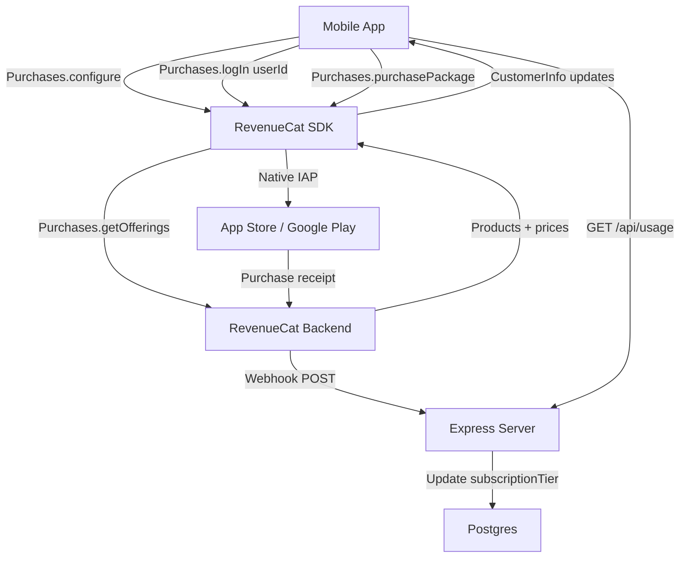

# Phase 9: RevenueCat SDK Integration — Implementation Plan

## Problem Statement

Phase 8 introduced a freemium model with daily AI usage limits, a subscription tier on the User model, and a RevenueCat webhook endpoint — but the "Upgrade to Pro" button shows a "Coming soon" alert. Phase 9 wires up the RevenueCat SDK (`react-native-purchases`) on mobile to enable real in-app purchases. This includes installing the SDK, configuring it with the user's app ID, building a custom paywall screen, connecting the purchase flow to the existing subscription infrastructure, and setting up EAS Build since native IAP modules can't run in Expo Go.

## Requirements

- Install `react-native-purchases` and `expo-dev-client` in the mobile app
- Configure RevenueCat SDK on app startup with platform-specific API keys
- Identify users with the app's User ID (`Purchases.logIn(userId)`) after auth so `app_user_id` in webhooks maps to the DB
- Log out from RevenueCat on app logout (`Purchases.logOut()`)
- Custom paywall screen matching the existing design system (theme tokens, `Button`, `AppModal` components)
- Paywall shows a single monthly subscription product ($4.99/month), designed to be extensible for annual later
- Paywall accessible from: Settings "Upgrade to Pro" row, usage limit modal "Upgrade to Pro" button
- After successful purchase, update local subscription state immediately (optimistic) — webhook handles server-side tier update
- Listen for `CustomerInfo` updates to keep local state in sync (handles restores, renewals, cancellations)
- "Restore Purchases" button on paywall for users who reinstall or switch devices
- Pro users see "Plan: Pro" in Settings with a "Manage Subscription" option (opens native subscription management)
- EAS Build configuration (`eas.json`) for development and production builds
- Store setup (App Store Connect, Google Play Console, RevenueCat dashboard) documented as prerequisites in README
- RevenueCat API keys stored as env vars in `apps/mobile/.env` (`EXPO_PUBLIC_RC_IOS_API_KEY`, `EXPO_PUBLIC_RC_ANDROID_API_KEY`)

## Background

### Existing Phase 8 Infrastructure
- `SubscriptionTier` enum (`FREE` / `PRO`) on User model, defaulting to `FREE`
- `AiUsage` table tracking per-user per-day usage counts
- `checkAiUsage` middleware on AI routes enforces limits for free users
- `GET /api/usage` returns `AiUsageResponse` with `used`, `limit`, `resetsAt`, `tier`
- `POST /api/webhooks/revenuecat` receives RevenueCat events and updates `subscriptionTier` — handles `INITIAL_PURCHASE`, `RENEWAL`, `UNCANCELLATION` → PRO and `EXPIRATION`, `CANCELLATION` → FREE
- `UsageLimitModal` component with "Upgrade to Pro" button (currently shows "Coming soon" alert)
- Settings screen shows "Plan: Free/Pro", usage count, and "Upgrade to Pro" row
- `useUsageStore` Zustand store with `tier`, `used`, `limit`, `resetsAt`, `fetch()`, `isAtLimit()`

### RevenueCat SDK Key Concepts
- `Purchases.configure({ apiKey })` — initialize SDK, one API key per platform (iOS/Android)
- `Purchases.logIn(appUserId)` — identify user with your app's ID, so webhooks send the same ID
- `Purchases.logOut()` — revert to anonymous user on logout
- `Purchases.getOfferings()` — fetch available products/packages configured in RevenueCat dashboard
- `Purchases.purchasePackage(package)` — trigger native purchase flow
- `Purchases.getCustomerInfo()` — check entitlements and subscription status
- `Purchases.restorePurchases()` — restore previous purchases on new device
- `Purchases.addCustomerInfoUpdateListener(callback)` — listen for subscription changes
- Entitlement: a named access level (e.g., "pro") that maps to one or more products
- Offering: a collection of packages (products) presented to the user
- Requires `expo-dev-client` + EAS Build — native IAP modules don't work in Expo Go (SDK has a Preview API Mode for Expo Go that mocks native calls, useful for UI development but not real purchases)

### RevenueCat Dashboard Setup (Prerequisites)
1. Create a RevenueCat account and project
2. Add iOS app (with App Store Connect shared secret / in-app purchase key)
3. Add Android app (with Play Service Credentials)
4. Create products in App Store Connect and Google Play Console (monthly subscription)
5. Create those products in RevenueCat dashboard
6. Create an entitlement named "pro"
7. Attach the monthly subscription product(s) to the "pro" entitlement
8. Create an offering named "default" containing the monthly package
9. Configure webhook URL pointing to `https://your-server.com/api/webhooks/revenuecat`
10. Set webhook authorization header to match `REVENUECAT_WEBHOOK_SECRET`

## Proposed Solution

Install `react-native-purchases` and `expo-dev-client`. Create a `use-purchases.ts` hook that initializes RevenueCat on app startup, identifies users after auth, and listens for subscription changes. Build a custom `Paywall` screen that fetches the current offering, displays the monthly product with price, and handles the purchase flow. Replace all "Coming soon" alerts with navigation to the Paywall screen. After a successful purchase, optimistically update the usage store's tier to PRO. The webhook (already built in Phase 8) handles the server-side tier update. Add EAS Build configuration and document store setup prerequisites.

### Flow Diagram

```
User taps "Upgrade to Pro" (Settings or Limit Modal)
  └── Navigate to Paywall screen
        ├── Fetch offerings from RevenueCat (Purchases.getOfferings())
        ├── Display monthly product with price from store
        ├── User taps "Subscribe"
        │     ├── Purchases.purchasePackage(monthlyPackage)
        │     ├── Native purchase sheet appears (App Store / Google Play)
        │     ├── On success → optimistic local update (tier = PRO)
        │     ├── RevenueCat webhook → server updates subscriptionTier
        │     └── Navigate back + show success snackbar
        ├── User taps "Restore Purchases"
        │     ├── Purchases.restorePurchases()
        │     └── If "pro" entitlement active → update tier + navigate back
        └── User taps back → return to previous screen
```

### Architecture Diagram



### New Files

```
apps/mobile/src/hooks/use-purchases.ts               # RevenueCat SDK init, logIn/logOut, listener
apps/mobile/src/screens/paywall/index.tsx             # Custom paywall screen
apps/mobile/eas.json                                  # EAS Build configuration
```

### Modified Files

```
apps/mobile/package.json                              # Add react-native-purchases, expo-dev-client
apps/mobile/app.json                                  # Add expo-dev-client plugin
apps/mobile/.env.example                              # Add EXPO_PUBLIC_RC_IOS_API_KEY, EXPO_PUBLIC_RC_ANDROID_API_KEY
apps/mobile/src/stores/auth.store.ts                  # Call Purchases.logIn on auth, Purchases.logOut on logout
apps/mobile/src/stores/usage.store.ts                 # Add setTier action for optimistic updates
apps/mobile/src/navigation.tsx                        # Add Paywall screen, init RevenueCat hook
apps/mobile/src/screens/settings/index.tsx            # Replace "Coming soon" alert with Paywall navigation, add "Manage Subscription" for Pro
apps/mobile/src/components/usage-limit-modal.tsx      # Replace "Coming soon" alert with Paywall navigation
docs/architecture.md                                  # Add RevenueCat SDK, Paywall screen, EAS Build
README.md                                             # Add RevenueCat setup prerequisites, EAS Build instructions, new env vars
```

## Task Breakdown

### Task 1: Install dependencies, EAS config, and env setup

- [ ] **Objective:** Install `react-native-purchases` and `expo-dev-client`, configure EAS Build, and add RevenueCat API key env vars.
- **Guidance:**
  - Run `npx expo install react-native-purchases expo-dev-client` in `apps/mobile`
  - Add `"expo-dev-client"` to the `plugins` array in `app.json`
  - Create `apps/mobile/eas.json` with build profiles:
    - `development`: `developmentClient: true`, `distribution: "internal"`
    - `ios-simulator`: extends `development` with `ios.simulator: true`
    - `preview`: `distribution: "internal"`
    - `production`: default
  - Add to `apps/mobile/.env.example`:
    ```
    EXPO_PUBLIC_RC_IOS_API_KEY="your-revenuecat-ios-api-key"
    EXPO_PUBLIC_RC_ANDROID_API_KEY="your-revenuecat-android-api-key"
    ```
  - Add the actual keys to `apps/mobile/.env` (gitignored)
  - Verify `pnpm install` succeeds and existing tests still pass
- **Test:** Dependencies install cleanly. `app.json` has the new plugin. `eas.json` is valid JSON. Existing tests pass.
- **Demo:** `cat apps/mobile/eas.json` shows build profiles. `cat apps/mobile/app.json` shows `expo-dev-client` plugin.

### Task 2: RevenueCat SDK initialization hook + auth store integration

- [ ] **Objective:** Create a hook that initializes RevenueCat, identifies users on login, and logs out on app logout. Listen for `CustomerInfo` updates to keep local subscription state in sync.
- **Guidance:**
  - Create `apps/mobile/src/hooks/use-purchases.ts`:
    - On mount, call `Purchases.configure({ apiKey })` with the platform-appropriate key from env vars
    - Add a `CustomerInfo` update listener that checks `customerInfo.entitlements.active["pro"]` — if active, set tier to PRO in usage store; if not, set to FREE
    - Export `initPurchases()` (called once on app startup) and `identifyUser(userId)` / `logoutPurchases()` functions
  - Update `apps/mobile/src/stores/auth.store.ts`:
    - After `setAuth` (login, googleLogin, verify-email), call `Purchases.logIn(user.id)` to identify the user with RevenueCat
    - In `logout`, call `Purchases.logOut()` before clearing local state
  - Update `apps/mobile/src/stores/usage.store.ts`:
    - Add `setTier(tier: SubscriptionTier)` action for optimistic updates from the `CustomerInfo` listener
  - Call `initPurchases()` in `navigation.tsx` on app startup (before auth restore)
  - Call `identifyUser(user.id)` after auth restore if token exists
- **Test:** Hook initializes SDK with correct platform key. `logIn` called after auth. `logOut` called on logout. `CustomerInfo` listener updates usage store tier.
- **Demo:** Log in → RevenueCat debug logs show `logIn` with user ID. Log out → logs show `logOut`. (Requires dev build to see real SDK logs; in Expo Go, Preview API Mode mocks the calls.)

### Task 3: Custom paywall screen

- [ ] **Objective:** Build a paywall screen that fetches the current offering from RevenueCat, displays the monthly product with its store price, and handles the purchase and restore flows.
- **Guidance:**
  - Create `apps/mobile/src/screens/paywall/index.tsx`:
    - On mount, call `Purchases.getOfferings()` to fetch the current offering
    - Display the monthly package from `offerings.current.monthly` (or first available package)
    - Show: app icon/branding, "Unlock Pro" title, feature list (unlimited AI lookups, priority support, etc.), product price from store (`package.product.priceString`), "Subscribe" button, "Restore Purchases" text button
    - Use existing design system: `Button`, theme tokens (`colors`, `spacing`, `fontSize`), `useColors()`
    - "Subscribe" button: call `Purchases.purchasePackage(package)`, on success → optimistically set tier to PRO via `useUsageStore.setTier(PRO)`, refresh usage, show success snackbar, navigate back
    - Handle purchase errors: user cancellation (silent dismiss), other errors (error snackbar)
    - "Restore Purchases": call `Purchases.restorePurchases()`, check `customerInfo.entitlements.active["pro"]`, if active → update tier + navigate back + snackbar, if not → "No active subscription found" snackbar
    - Loading state while fetching offerings
    - Error state if offerings fail to load
  - Add `Paywall` to `MainStackParamList` in `navigation.tsx` and register the screen
- **Test:** Screen renders with product info. Subscribe button triggers purchase. Restore button triggers restore. Error states display correctly. Success navigates back.
- **Demo:** Open Paywall screen → see monthly product with price → tap Subscribe → native purchase sheet (in sandbox) → success → back to Settings showing "Plan: Pro".

### Task 4: Wire up "Upgrade to Pro" buttons to Paywall

- [ ] **Objective:** Replace all "Coming soon" alerts with navigation to the Paywall screen.
- **Guidance:**
  - Update `apps/mobile/src/screens/settings/index.tsx`:
    - "Upgrade to Pro" row: replace `Alert.alert("Coming Soon", ...)` with `navigation.navigate("Paywall")`
    - For Pro users: replace "Upgrade to Pro" row with "Manage Subscription" row that opens the native subscription management URL via `Purchases.showManageSubscriptions()`
  - Update `apps/mobile/src/components/usage-limit-modal.tsx`:
    - "Upgrade to Pro" button: replace `Alert.alert("Coming Soon", ...)` with navigation to Paywall
    - Accept an `onUpgrade` callback prop (or use navigation directly) to navigate to Paywall and close the modal
  - Update `apps/mobile/src/screens/daily-view/index.tsx` and `apps/mobile/src/screens/goals/index.tsx`:
    - Pass the navigation callback to `UsageLimitModal` so it can navigate to Paywall
  - After returning from Paywall (purchase success), refresh usage store to reflect new tier
- **Test:** Settings "Upgrade to Pro" navigates to Paywall. Limit modal "Upgrade to Pro" navigates to Paywall. Pro users see "Manage Subscription" instead. All existing limit interception still works.
- **Demo:** Hit AI limit → modal appears → tap "Upgrade to Pro" → Paywall screen. Settings → "Upgrade to Pro" → Paywall screen. After purchase → Settings shows "Plan: Pro" + "Manage Subscription".

### Task 5: EAS Build setup and store prerequisites documentation

- [ ] **Objective:** Document the complete store setup prerequisites and EAS Build workflow in README.
- **Guidance:**
  - Update `README.md` with a new "In-App Purchases Setup" section covering:
    - **Prerequisites:** Apple Developer account ($99/year), Google Play Console account ($25 one-time)
    - **App Store Connect setup:** Create app, add monthly subscription product, configure subscription group, set pricing, add in-app purchase key
    - **Google Play Console setup:** Create app, add monthly subscription product, configure base plan, set pricing, create Play Service Credentials (service account)
    - **RevenueCat dashboard setup:** Create project, add iOS + Android apps with credentials, create products mirroring store products, create "pro" entitlement, attach products, create "default" offering with monthly package, configure webhook URL + auth header
    - **EAS Build:** Install `eas-cli`, `eas login`, `eas init`, `eas build:configure`, build commands for simulator and device
    - **Environment variables:** `EXPO_PUBLIC_RC_IOS_API_KEY`, `EXPO_PUBLIC_RC_ANDROID_API_KEY` in `apps/mobile/.env`
    - **Testing:** Sandbox testing on iOS (sandbox Apple ID), testing on Android (license testers in Play Console), RevenueCat Test Store for development
  - Add `EXPO_PUBLIC_RC_IOS_API_KEY` and `EXPO_PUBLIC_RC_ANDROID_API_KEY` to the existing env vars section in README
  - Note that RevenueCat SDK requires production builds (`eas build`) — cannot be fully tested in Expo Go (Preview API Mode available for UI development only)
- **Test:** README renders correctly. All setup steps are clear and sequential.
- **Demo:** Follow the README to set up a new developer's environment — all steps documented.

### Task 6: Edge cases, polish, and architecture docs

- [ ] **Objective:** Handle edge cases, update architecture docs, and ensure everything works end-to-end.
- **Guidance:**
  - Handle offline/network errors in paywall (show error state, allow retry)
  - Handle case where offerings are empty (RevenueCat not configured yet) — show "Subscriptions not available" message
  - Handle `CustomerInfo` listener firing after purchase — avoid double navigation or double snackbar
  - Refresh usage store when returning to app from background (handles subscription changes made outside the app, e.g., cancellation via Settings)
  - Ensure `Purchases.logIn` is called after auth restore on app startup (not just on fresh login)
  - Update `docs/architecture.md`:
    - Add RevenueCat SDK to Tech Stack table
    - Add `use-purchases.ts` hook, Paywall screen, EAS Build to relevant sections
    - Add RevenueCat flow to API Design / Auth Flow sections
    - Update Phase Roadmap section
  - Update `docs/phase-roadmap.md`: mark Phase 9 status as "Completed", add link to implementation plan
- **Test:** Full end-to-end: free user → hit limit → paywall → purchase → pro → unlimited AI. Restore works on fresh install. Logout/login preserves subscription. Webhook updates tier server-side.
- **Demo:** Complete walkthrough of the purchase flow. Settings reflects correct tier. AI limits removed for Pro. Manage subscription opens native UI.

### Task 7: Comprehensive test coverage

- [ ] **Objective:** Add tests for all Phase 9 features (frontend).
- **Guidance:**
  - Frontend:
    - `use-purchases` hook (configure called with correct key, logIn/logOut called at right times, CustomerInfo listener updates store)
    - Paywall screen (renders product info, subscribe triggers purchase, restore triggers restore, error states, success navigation)
    - Settings screen (Upgrade navigates to Paywall, Pro users see Manage Subscription)
    - Usage limit modal (Upgrade navigates to Paywall instead of alert)
    - Auth store integration (logIn calls Purchases.logIn, logout calls Purchases.logOut)
  - Mock `react-native-purchases` module in tests (SDK requires native modules)
  - Follow existing conventions in `.kiro/skills/mobile-testing-conventions.md`
  - Mark Phase 9 as completed in `docs/phase-roadmap.md`
- **Test:** All new tests pass. Existing tests unaffected. `pnpm test` runs full suite.
- **Demo:** Run `pnpm test` — all green, including new Phase 9 tests.
